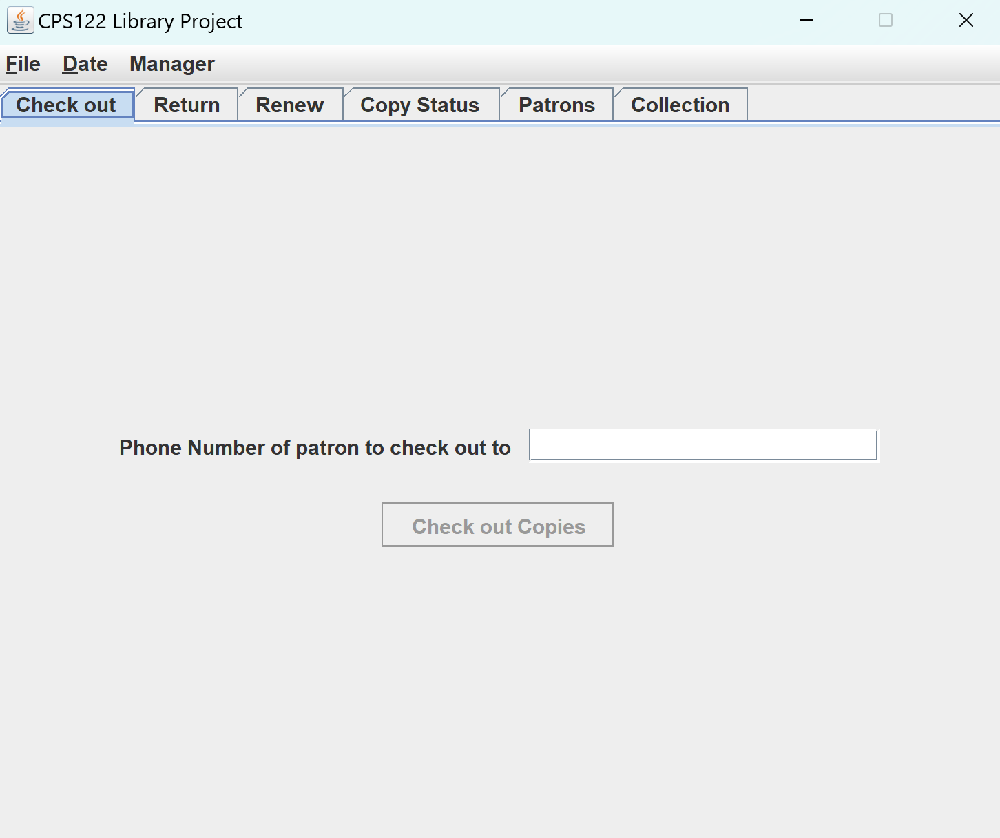

# Library Database
This JavaGUI app is built for library managers and desk clerks to check out various items in a library. 

It includes the ability to: 
- checkout
- return
- renew
- find the status of an item
- login/ logout as a manager
- see patrons and items in the library
- change the date to see when the item is due

